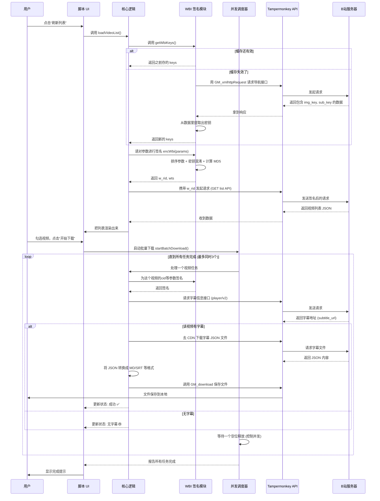

# 一次关于 B 站数据接口的技术逆向随记


> **📌 项目状态说明**
>
> 考虑到批量自动化工具可能涉及的风险，这个脚本最初用于“一键下载”的功能已经**停止维护**。相关的用户脚本不再提供。
>
> **现在的定位**：这篇文章更多是记录一次针对 Web 端数据接口（主要是 WBI 签名和字幕协议）的**技术摸索过程**。内容偏向于分析其机制原理，算是一个不成熟的技术实践样本。

---

## 初衷与边界

# 初衷：一个初学者的技术摸索笔记

写下这些文字时，我依然觉得自己和“程序员”这个词相距甚远。这一切的开始，无关乎任何宏大的项目愿景，仅仅源于一个非常个人的需求：我想系统性地整理一些对我有启发的B站视频内容，构建一个属于自己的知识库。

我的代码之旅，始于AI。在最开始的阶段，`Claude`、`Cursor` 的 “Vibe Coding” 功能是我唯一的向导。我像个蹒跚学步的孩子，通过向它们描述我想要什么，来观察一行行代码是如何“生长”出来的。从完全看不懂，到能勉强理解逻辑，再到亲手完成了第一次 `git commit`——那一刻在终端里看到成功的提示，内心的雀跃难以言表，仿佛推开了一扇全新世界的大门。

我的第一次实践，是用 Python 写本地脚本。我尝试了 `requests` 直连、`selenium` 模拟，甚至一些现成的第三方库。过程就像在玩一个概率游戏：针对我收集好的视频URL列表，脚本偶尔能成功返回正确的字幕，但更多时候，返回的是风马牛不相及的“随机错误字幕”。多跑几次，接口就可能报错或拒绝。这个名为 **Cooper Factory** 的项目，最终被我静静搁置在仓库里（既然失败了，就留着当作一个纪念吧，一笑）。

碰壁之后，我与 `Gemini` 进行了一次长谈。问题的核心在于：以我个人使用为目的，并不需要、也没有能力搭建一个工程化的后端服务去处理复杂的Cookie维护和签名逻辑。对比了各种可能的载体后，**Tampermonkey** 油猴脚本进入了视野。它的优势很直接：运行在浏览器环境中，可以天然地复用我已经登录的会话状态，这完美地绕过了我最头疼的认证采集问题。

在转向 Tampermonkey 并借鉴、拼凑了一些开源社区的规则思路后，事情出现了转机。虽然整个过程谈不上任何“优雅”或“规范”，代码更像是用胶水和绷带粘起来的，但我终于**拙劣地实现了基本功能**。从下载单个视频的字幕开始，我一点点尝试：扩展到处理一个包含上百个视频的合集，再到后来，甚至能遍历一个UP主的数千个视频列表进行抓取。

就在批量下载功能真正跑通的那一刻，一股异样的感觉取代了最初的兴奋。我盯着屏幕上自动滚动、生成的文件列表，突然清晰地意识到：**技术是一种能力，而能力背后对应着责任**。尽管这个“能力”还很渺小、粗糙（毕竟我才学了几天），尽管我对这个项目的整体架构理解可能还不到5%，远不具备将其规范化的实力，但那种可能被滥用（即使是被我自己无意识地滥用）的潜在风险，让我停了下来。

因此，我中断了任何发布的念头，转而开始了持续的自我批判。比起将一个不成熟的工具分享出去，**诚实地记录下这段从零开始、充满困惑与试错的探索过程，对我而言意义更大**。我只想扮演一个谦卑的朝圣者，记录下这段通往技术之门的、歪歪扭扭的足迹。

## 主要碰过的技术点

> 下面的流程图和代码更直观，但实现上比较粗糙。

### 关于 WBI 签名

为了能调用一些接口，不得不去尝试理解它的签名机制。大概的流程是：

1.  **先拿到钥匙**：从页面一个不起眼的接口里，取出两个看起来是图片 URL 的字符串，其实里面藏着 `img_key` 和 `sub_key`。
2.  **配“盐”计算**：把请求参数按字母排好，加上前面拿到的“钥匙”混合一下，最后算出 MD5 值，生成一个叫 `w_rid` 的参数。

下面是一段当时参考多方信息拼凑出来的算法，未必精确，但勉强能跑通：

```javascript
// WBI 签名的一种实现参考
const mixinKeyEncTab = [
    46, 47, 18, 2, 53, 8, 23, 32, 15, 50, 10, 31, 58, 3, 45, 35, 27, 43, 5, 49,
    33, 9, 42, 19, 29, 28, 14, 39, 12, 38, 41, 13, 37, 48, 7, 16, 24, 55, 40,
    61, 26, 17, 0, 1, 60, 51, 30, 4, 22, 25, 54, 21, 56, 59, 6, 63, 57, 62, 11,
    36, 20, 34, 44, 52
];

// 从原始钥匙字符串里，按一个固定的表把字符挑出来，组成32位的混合钥匙
function getMixinKey(orig) {
    let temp = '';
    mixinKeyEncTab.forEach((n) => {
        if (n < orig.length) {
            temp += orig[n];
        }
    });
    return temp.slice(0, 32);
}

// 主要的签名函数
function encWbi(params, img_key, sub_key) {
    const mixin_key = getMixinKey(img_key + sub_key);
    const curr_time = Math.round(Date.now() / 1000); // 当前时间戳
    const newParams = { ...params, wts: curr_time }; // 把时间戳也作为参数
    const sortedKeys = Object.keys(newParams).sort(); // 参数名按字典序排序
    
    // 把参数拼接成查询字符串
    let query = sortedKeys.map(key => {
        return `${encodeURIComponent(key)}=${encodeURIComponent(newParams[key])}`;
    }).join('&');
    
    const w_rid = SparkMD5.hash(query + mixin_key); // 最后计算 MD5
    return { w_rid, wts: curr_time };
}
```

---

# 实现过程的梳理与反思

在画流程图之前，我觉得有必要先聊聊做这个东西时的一些真实想法，以及回头再看时发现的各种不成熟的地方。

### 为什么要用 UserScript 来做？

1.  **第一层**：最初只是想省事。用 Python 写爬虫要处理 Cookie、Session 挺麻烦的。而 UserScript 直接在浏览器里跑，天然就能用上我当前登录的状态，感觉取巧了。
2.  **第二层**：跑起来后发现，即使有 Cookie，很多接口也调不通了，因为要 WBI 签名。于是又得去逆向前端的签名逻辑，这个过程有点像“用你的矛，攻你的盾”。
3.  **第三层**：当想批量处理时，发现直接并发请求很容易被限制。所以又写了简单的队列和延迟，试图让请求看起来“慢”一点，像人在操作。这其实是一种很笨的对抗。
4.  **第四层**：下回来的字幕数据，偶尔会遇到 ProtoBuf 格式的，不是 JSON。这就得额外找解析库来处理二进制流，算是意外收获。
5.  **最后**：回过头看，整个项目的核心其实就一句话：**利用浏览器这个“沙箱”里已有的资源和执行能力，去尝试做一些它本来不太鼓励的事情**。这更像是一个技术验证，证明“可行”，但离“好用”或“优雅”差得很远。

### 客观来看，代码写得并不好

从工程角度审视，这个项目有很多值得商榷的地方：

1.  **结构有点乱**：主文件一个脚本里塞了 UI、网络请求、业务逻辑、工具函数。就像把所有的东西都扔进了一个大抽屉，找起来麻烦，改起来也怕碰坏别的东西。几乎没法做单元测试。
2.  **并发控制很初级**：所谓的“队列”其实就是用 `setTimeout` 做了些固定延迟，没有根据服务器响应动态调整的策略。在稍微严格点的风控面前，这种策略可能不堪一击。
3.  **前端逆向的天然短板**：所有的逻辑都暴露在浏览器里。一旦对方更新了签名算法或者增加了新的验证步骤，脚本立刻就会失效，然后就需要手动跟进、分析、修改。维护成本不低。
4.  **对运行环境的“非常规”使用**：浏览器本意是用来渲染网页的，用它来发起大量网络请求并处理文件下载，有时会感觉比较“重”，可能引起页面卡顿，并不适合作为稳定的生产环境。

**小结一下**：这个项目可以作为一个**了解 Web 逆向和浏览器扩展能力的小例子**，但代码本身的质量和设计，只能说是一个勉强能运行的“原型”，离一个健壮的工具还有很长的路要走。

---

下面的图表尝试展示当时这个脚本是如何运作的，其中黄色高亮的部分，是依赖 UserScript 管理器（如 Tampermonkey）提供的特殊能力才能实现的，普通网页 JavaScript 做不到。

## 1. 核心流程示意

> **注**：下图描述的是早期版本中“批量下载”模式的流程，仅作为理解其并发调度逻辑的参考，并非推荐架构。

```mermaid
flowchart TD
    %% 样式定义
    classDef privilege fill:#ff9,stroke:#f66,stroke-width:2px,color:black;
    classDef ui fill:#e1f5fe,stroke:#01579b,stroke-width:1px;
    classDef logic fill:#f3e5f5,stroke:#4a148c,stroke-width:1px;

    Start((开始)) --> Init[向页面注入UI面板]:::ui
    Init --> ModeCheck{用户选择模式?}:::ui
    
    ModeCheck -- 当前视频/合集 --> FetchBasic[获取当前页面视频信息]:::logic
    ModeCheck -- UP主所有视频 --> FetchUp[获取UP主空间视频列表]:::logic
    
    subgraph “依赖特权的操作 (UserScript 提供)”
        FetchBasic -->|GM_xmlhttpRequest| BiliAPI[B站 API]
        FetchUp -->|GM_xmlhttpRequest + WBI签名| BiliAPI
        
        WBI_Process[计算 WBI 签名]:::privilege
        BiliAPI -.->|某些接口需要签名| WBI_Process
        WBI_Process -.->|附加上 w_rid 参数| BiliAPI
    end
    
    BiliAPI -->|返回 JSON| ParseList[解析出视频列表和 CID]:::logic
    ParseList --> RenderList[在面板上显示列表]:::ui
    
    RenderList --> UserSelect[用户勾选想下载的视频]:::ui
    UserSelect --> ClickDownload[点击“开始下载”按钮]:::ui
    
    ClickDownload --> BatchQueue[初始化一个处理队列]:::logic
    
    subgraph “批量处理流水线 (并发数限制为3)”
        BatchQueue -->|从队列取任务| FetchSubInfo[获取单个视频的字幕信息]:::privilege
        FetchSubInfo -->|GM_xmlhttpRequest| BiliAPI
        
        BiliAPI -->|返回字幕文件地址| DownloadJSON[去下载字幕JSON文件]:::privilege
        DownloadJSON -->|跨域请求| BiliCDN[B站的 CDN]
        
        BiliCDN -->|返回JSON内容| FormatConvert[格式转换<br>JSON -> MD/SRT/LRC]:::logic
        FormatConvert --> FileGen[创建 Blob 对象]:::logic
    end
    
    FileGen -->|GM_download| SaveLocal[保存文件到本地磁盘]:::privilege
    SaveLocal --> UpdateUI[更新进度条和状态]:::ui
    UpdateUI --> CheckNext{队列里还有任务吗?}
    
    CheckNext -- 有 --> BatchQueue
    CheckNext -- 没有 --> Finish((结束))

    %% 图例说明
    subgraph Legend
        PNode[“黄色节点: 依赖UserScript特权<br>突破浏览器常规限制”]:::privilege
    end
```

---

### 所依赖的“特殊能力”解析

1.  **`GM_xmlhttpRequest` (跨域请求)**
    *   **平时不行**：普通网页脚本受同源策略限制，不能随便向 `api.bilibili.com` 或其他域名发请求，也读不全响应头。
    *   **这里怎么做的**：通过这个特权 API，脚本可以像后端服务器一样直接发送 HTTP 请求，还能自定义 `Referer` 等头部，相当于绕过了浏览器的网络沙箱。

2.  **`WBI 签名计算` (在客户端复现)**
    *   **平时做法**：正常开发时，用的是官方提供的 JS SDK 或由后端服务来负责签名。
    *   **这里怎么做的**：通过逆向分析，把前端的签名算法（混淆密钥表、排序、MD5）自己实现了一遍，让脚本能勉力模仿出合法的请求参数。

3.  **`GM_download` (直接触发下载)**
    *   **平时不行**：用 `<a>` 标签下载，浏览器总会弹窗问你要存在哪里，而且文件名不一定是你想要的。
    *   **这里怎么做的**：`GM_download` 允许脚本指定文件名和保存行为，在某些浏览器里可以做到“静默”下载，控制力更强。

---

## 2. 交互时序示意

这张图更细致地展示了从获取列表到批量下载过程中，各个模块之间是如何配合的，尤其是签名和队列调度发生的时间点。



## 3. 一点对比：非主流做法的差异

| 方面 | 常规前端应用 (如 React/Vue) | 本项目 (UserScript 方式) | 本质区别 |
| :--- | :--- | :--- | :--- |
| **网络请求** | 用 `fetch` / `axios`，受同源策略限制。 | 用 `GM_xmlhttpRequest`。 | **突破同源限制**：可以直接访问任意域名，无需后端做代理转发。 |
| **API 鉴权** | 依赖后端服务器计算签名，或使用官方封装的 SDK。 | **在浏览器里自己算签名 (WBI)**。 | **去中心化**：所有鉴权逻辑都在客户端完成，不依赖自己的服务器。 |
| **文件下载** | 用 `<a download>` 或创建 `Blob URL`，会受浏览器下载策略影响。 | 用 `GM_download`。 | **更高文件权限**：能更好地控制下载行为和文件名，绕过部分浏览器对话框。 |
| **并发控制** | 简单用 `Promise.all`，容易被目标服务器识别为异常流量。 | **自己写了简单的调度器 (控制并发和延迟)**。 | **对抗性设计**：加入了延迟和限流，试图让请求模式更像真人操作。 |
| **数据聚合** | 通常从自己的后端接口获取聚合好的数据。 | **直接调用多个 B 站原版 API 来拼凑数据**。 | **混合数据源**：同时调用了面向网页的和面向用户空间的接口来获取完整信息。 |

总的来说，这更像是一次“剑走偏锋”的尝试。它利用了浏览器扩展环境的特殊权限，用一种比较“野”的路子，勉强实现了一个数据抓取的原型。代码和架构上都有很多瑕疵，但作为一次理解 Web API 和安全机制的学习过程，或许有点参考价值。

## 🧭 后续可能的探索方向 (随想)

*   [ ] **WBI 签名的独立封装**：如果把签名算法单独抽出来做成一个库，或许能方便其他人在研究时使用。
*   [ ] **更深入看 ProtoBuf**：目前只是简单解析了 JSON 接口返回的字幕地址。对于可能存在的 gRPC/ProtoBuf 接口，如何在前端解析值得再看看。
*   [ ] **脚本环境的沙箱化**：UserScript 直接操作页面全局环境其实有点危险。有没有办法在脚本内部构建一个更隔离的执行环境？

## 🛡️ 免责声明

1.  本文及所涉及代码仅供**个人技术学习与研究**之用，记录了分析过程和一种实现思路。
2.  请勿将相关技术用于任何形式的**大规模自动化抓取、商业用途**或侵犯内容平台及创作者合法权益的行为。
3.  任何因使用或借鉴本文内容而产生的后果，需由使用者自行承担。