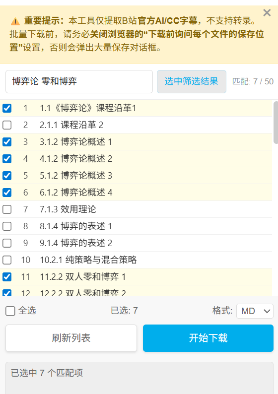
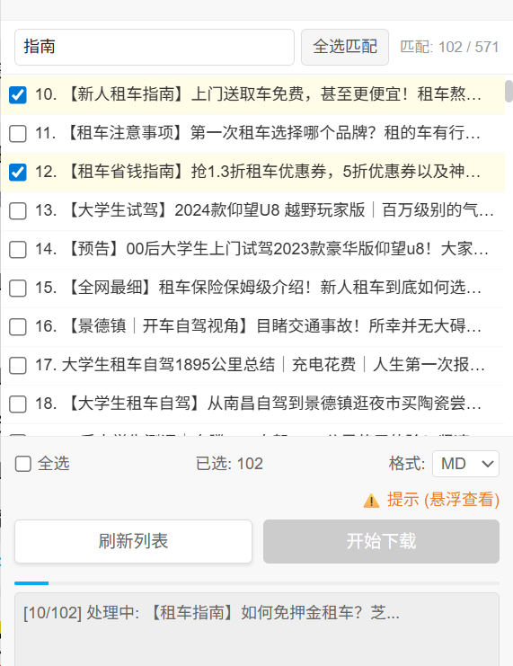
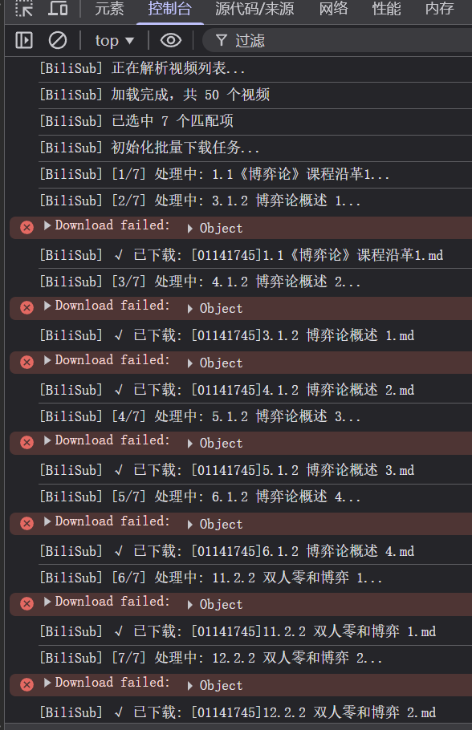

# Bilibili Subtitle Batch Downloader - B站AI字幕批量下载神器

> **🚀 告别逐个点击！一键批量下载 B 站视频/合集AI字幕，专为学习与资料整理打造。**
> 
> 支持 **MD (Markdown)**、**TXT**、**LRC**、**SRT** 等多种格式，完美适配 **Obsidian**、**Notion** 等笔记软件。内置 WBI 签名与并发控制，稳定、高速、防风控。

---

## 📺 效果演示 (Preview)

| **多关键词筛选** | **高速并发实时处理** |**批量稳定性**|
| :---: | :---: | :---: |
|  | ||
| *👆 支持多关键词空格筛选，一键选中筛选结果项* | *👆 实时进度显示，高速并发直连下载* |*👆 稳定应对b站防风控，批量成功率极高*|

---

## ✨ 核心亮点 (Why Use This?)

*   **📚 笔记党福音**：支持 **.md (Markdown)** 格式导出，下载后直接拖入 Obsidian/Notion，方便进行后续文本处理（计划后续推出相关的md批量处理工具，一键进行原子化，生成双链笔记）！
*   **⚡ 极速批量下载**：自动获取当前所处的视频合集/列表/番剧，可按任意筛选规则，一键下载数百集字幕，无需手动重复操作（大批量操作务必关闭浏览器的“下载前询问每个文件的保存位置”设置，否则会弹出大量保存对话框。）。
*   **🛡️ 稳定防风控**：
    *   内置 **WBI 签名算法**，完美解决 B 站接口鉴权问题（403 Forbidden）。
    *   **智能并发控制**（默认 3 线程）+ **指数退避重试**，防止 IP 临时封禁。
*   **📂 直连下载模式**：未选用 ZIP 打包（避免大文件浏览器崩溃），采用浏览器原生下载 API，文件直接保存到本地。
*   **🔍 强大的筛选器**：
    *   支持**多关键词**（空格分隔）筛选，例如输入 `课程 01` 即可精准选中目标视频。

## 🚀 安装与使用

### 安装方式

#### 方式一：GitHub 直接安装（🔥 推荐）
1.  确保您的浏览器已安装 **Tampermonkey** (篡改猴) 扩展。
2.  👉 **[点击这里直接安装脚本](https://github.com/Coope-X-Oak/bilibili-subtitle-downloader/raw/main/bilibili_subtitle_downloader.user.js?v=1.06)**
    > *如果点击后显示代码而非安装界面，请复制链接地址，在 Tampermonkey 管理面板中点击 "工具" -> "从 URL 安装"。*

#### 方式二：GreasyFork 安装
> *注：由于刚注册，新账号发布受限，GreasyFork 发布的更新可能有延迟，推荐使用 GitHub 方式获取最新版。*
1.  访问 [GreasyFork 脚本页面](https://greasyfork.org/scripts/YOUR_SCRIPT_ID) (待上线)。
2.  点击 **“安装此脚本”** 按钮。

### 使用指南

1.  **打开页面**：进入 Bilibili 个人空间的“视频/合集”页，或番剧/电影列表页。
2.  **呼出面板**：页面右侧会出现 **“✨AI字幕神器”** 悬浮按钮，点击展开。
3.  **筛选视频**：
    *   点击`刷新列表`按钮，加载所在合集内所有视频。
    *   输入关键词（如 `第一章 第五章`），可同时筛选多个关键词，用空格键隔开，点击 **“选中筛选结果”**。
4.  **选择格式**：
    *   推荐选择 **`MD`** 格式（适合笔记）或 `SRT` 格式（适合播放器挂载）。
5.  **开始下载**：
    *   🔴 **关键一步**：大批量下载字幕，建议关闭浏览器的 **“下载前询问每个文件的保存位置”** 选项！（会逐个弹窗）
    *   点击 **“开始下载”**，稍等片刻，所有字幕即刻保存到您的电默认下载位置。

## 🔧 核心技术揭秘：WBI 签名机制

**为什么需要 WBI 签名？**

在 B 站最新的接口升级中，`player/v2` 等关键接口已全面启用 **WBI (Web Basic Identity)** 签名校验机制。这是一种参数签名保护措施。

*   **如果不带签名**：请求会被直接拒绝（403 Forbidden）。
*   **如果签名错误**：服务器可能会看似正常返回 200 OK，但返回的是**虚假数据**（例如：空的字幕列表、错误的旧缓存数据、或者不完整的视频信息），这会导致下载的内容与实际视频严重不匹配，甚至下载失败。

**本脚本的解决方案：**

本脚本内置了完整的 WBI 签名算法实现：
1.  **自动获取密钥**：实时请求 B 站导航接口获取最新的 `img_key` 和 `sub_key`。
2.  **动态计算签名**：对请求参数进行字典序排序、拼接、混淆，并结合当前时间戳 `wts` 计算 `w_rid`。
3.  **100% 准确率**：通过这一机制，脚本能够通过 B 站服务器的校验，获取到**最准确、最实时**的字幕数据，彻底解决了字幕偏移或内容为空的问题。

## ⚙️ 自动化与开源

本项目完全开源，并配置了 GitHub Actions 自动化流程：
*   **自动构建**：Main 分支提交代码后，自动提取元数据。
*   **自动发布**：构建成功后自动同步至 GreasyFork，确保用户第一时间获取更新。

## 🤝 贡献与反馈

如果您觉得这个脚本好用，请给项目点个 **⭐️ Star**！
遇到问题或有新功能建议？欢迎提交 [Issue](https://github.com/Cooper-X-Oak/bilibili-subtitle-downloader/issues) 或 Pull Request。

## ☕ 支持与打赏

如果这个项目对你有帮助，欢迎考虑请我喝杯咖啡，助力持续开发与维护！ 

## 📜 许可证

本项目采用 [MIT License](LICENSE) 许可证。
